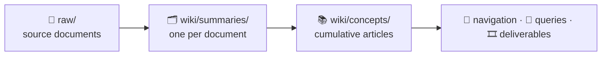

# 🩺 my-wiki

An **AI-compiled personal health wiki**: add raw lab results, imaging reports,
and clinical notes, then use AI prompts to build and maintain a cross-linked
medical knowledge base — optionally bilingual, with inline Chinese glosses in
Traditional (繁體中文) or Simplified (简体中文) Chinese, or English-only.

The maintainer's wiki currently contains 📚 **70** concept articles · 🗂️ **17**
clinical domains · 📄 **80** source documents · 💬 **19** saved Q&As · 🎞️ **9**
slide decks · 🤝 **4** handoff docs · 🈶 bilingual (English · 繁體中文). The graph
below shows that current vault. **A fresh clone starts empty and grows as you
ingest your own documents.**


> ⚕️ **Scope: medical data only.** The tags, article formats, and MOC (Map of
> Content) structure are designed for clinical domains. Keep finance, recipes,
> and general notes in a separate wiki.

## 1. ✨ Overview

Ingest turns source documents in `raw/` — lab panels, imaging reports, clinical
notes, and medication records — into structured **summaries**, **concept
articles**, **Q&A records**, and **deliverables** such as physician handoffs and
Marp slide decks. The resulting notes use Obsidian-style `[[backlinks]]` and,
when a Chinese locale is configured, inline Chinese glosses for clinical
vocabulary.



The two central file types have distinct jobs:

- A **summary** answers *"What did this report say?"* and remains frozen at its
  date.
- A **concept** answers *"What do we know about this now?"* and accumulates
  information from every related document.

The Deep Dive explains how the workflows maintain that split.

Patient-facing medical prose follows the shared style policy in `CLAUDE.md`: preserve every fact and qualification, use clear natural language, and never strengthen conclusions. Use `/rewrite` or `$rewrite` to apply the same rules to existing files, directories, or glob-selected documents.

## 2. 📦 Prerequisites

| Requirement | Needed for | Notes |
|---|---|---|
| **Claude Code** or **Codex** | every workflow | Prompts define the work; the agent runs them. |
| **Python 3.9+** | `/ingest`, `/post-ingest`, `/session-close`, `/contradiction-check`, `/coverage-check`, `/lint`, `/translation-backfill` | The `scripts/` checkers use only the standard library, so no `pip install` is needed. Python 3.9 is the minimum because of built-in generic annotations. |
| **Node.js** | `/slides` only | Decks render through `npx --yes @marp-team/marp-cli@latest`. All other workflows work without it. |
| **Obsidian** | reading the vault | Recommended for graph view, `[[backlinks]]`, and search. It is not needed to author content, but it is the intended reading interface. |

The remaining workflows (`/qa`, `/session-reopen`, `/triage-queries`, `/synthesis`) need only the agent.

To confirm the Python side on a fresh clone:

```
python3 scripts/tag-index.py
```

It prints empty `CONCEPTS` and `SUMMARIES` tables until you ingest something; that
empty output is the success case.

## 3. 🚀 Getting Started

Choose either supported agent. The workflow is the same; only the command
syntax differs.

| Agent | Start or invoke workflows |
|---|---|
| **Claude Code** | In this directory, run `claude`, then use slash commands such as `/ingest`. |
| **Codex** | Open this repository in Codex, then invoke the matching skills, such as `$ingest`. See [Running in Codex](#63-running-in-codex) for the complete command map. |

1. **Configure the vault before its first ingest.** Choose the language for
   newly generated clinical prose, then run one of these commands:

   ```sh
   bash scripts/new-vault.sh zh-TW  # Traditional Chinese, Taiwan wording
   # bash scripts/new-vault.sh zh-CN  # Simplified Chinese, Mainland wording
   # bash scripts/new-vault.sh none   # English only
   ```

   The script creates `wiki-config.yml`, selects the appropriate glossary,
   creates an empty provenance roster when needed, and verifies the setup. Then
   replace `region: TODO` in `wiki-config.yml` with your default care market.

   Choose carefully: changing locale later does **not** convert prose already
   in the vault. If you prefer manual setup, copy `wiki-config.example.yml` to
   `wiki-config.yml` and edit it before continuing.
2. **Add source documents** to `raw/`. The workflows never modify their
   contents. Source files follow the format
   `{descriptive-slug}-{YYYY-MM-DD}.{ext}` — for example,
   `chest-x-ray-2020-01-01.txt` — where the slug describes the study, panel, or
   visit and the date is the clinical date printed in the document, or no date
   at all when the document prints none. If a newly added filename does not fit
   that format, the ingestion workflow renames it by determining a suitable
   name from the document. Because `raw/` is tracked, use only a private remote
   you control for personal records; see [Git Setup](#61-git-setup).
3. **Build or update the wiki** with `/ingest` in Claude Code or `$ingest` in
   Codex. The same workflow handles both the first import and later additions,
   processing only files not already recorded in `wiki/processed.log`. If it
   renames a source file, it records the arriving name in `wiki/processed.log`
   as `(was: …)` and uses that name to recognize the same file if it is added
   again later. When it finds such a duplicate, it stops and identifies the
   file already ingested so you can remove the re-added copy instead of
   creating a second summary. After processing new files, it automatically runs
   post-ingest checks for tags, frontmatter, backlinks, MOCs, and record
   consistency.
4. **Ask questions** with `/qa your question` or `$qa your question`.
   The first question opens a session; follow up in the same way to retain its
   context. Working answers stay in `wiki/sessions/` until you close the
   session.
5. **Publish the useful result** with `/session-close` or `$session-close`.
   It turns the session into a saved Q&A in `wiki/queries/` (or a handoff in
   `wiki/deliverables/`), archives the session, and clears the working copies.

## 4. 🔄 Ongoing Maintenance & Extras

After the first ingest, use these commands as needed:

1. Run `/coverage-check` monthly to find thin or missing articles, missing
   concept links, MOC or `home.md` drift, and candidates for new articles.
2. Run `/contradiction-check` occasionally to find numeric drift (values, dates,
   counts, and ranges) and inconsistent medication or condition status. It
   automatically applies only unambiguous numeric fixes; all other findings are
   presented as choices, and status findings are never auto-fixed. This command
   can edit files, so review its uncommitted changes before committing.
3. Run `/triage-queries` when needed to relocate misplaced files from the
   `wiki/queries/` root.
4. Run `/lint` quarterly for a full health check and written maintenance report.
5. Use `/slides` to create a Marp presentation from any wiki topic.

## 5. 🧭 Workflows

These 15 workflows run in **Claude Code** or **Codex**; you can switch between
them. In Claude Code, type `/` followed by the command name, such as `/ingest`.

| Prompt | Slash Command | Purpose |
|--------|---------------|---------|
| `p1-ingest.md` | `/ingest` | Process every unlogged file in `raw/`; works for the first run and later additions, and automatically chains `/post-ingest` when it adds files. |
| `p3-qa.md` | `/qa` | Ask a wiki question. Starts a session when needed and preserves prior turns for follow-ups; only `/session-close` publishes the result. |
| `p3b-session-close.md` | `/session-close` | Consolidate and publish a session to `wiki/queries/` or, for a clean handoff, `wiki/deliverables/`; archive and remove the working session files. |
| `p3c-session-reopen.md` | `/session-reopen` | Restore an archived session to `current.md` and continue it. |
| `p4a-post-ingest.md` | `/post-ingest` | Check only what the latest ingest changed: tags, record format, frontmatter, connections, MOCs, `home.md`, and translation quality. Runs automatically after `/ingest`; use alone after manual edits. |
| `p4b-contradiction-check.md` | `/contradiction-check` | Compare numeric claims and medication or condition status across `wiki/concepts/`. **Edits files:** automatically corrects only unambiguous numeric drift and presents choices for everything else. |
| `p4c-coverage-check.md` | `/coverage-check` | Monthly repository-wide pass for thin or missing articles, missing backlinks, MOC and `home.md` reconciliation, new article candidates, and translation QA on its changes. |
| `p4d-triage-queries.md` | `/triage-queries` | Interactively relocate misplaced files from the `wiki/queries/` root. |
| `translation-backfill.md` | `/translation-backfill` | Repair missing Chinese translations in existing content (Chinese locales only). |
| `p4-lint.md` | `/lint` | Quarterly health check: every maintenance-matrix check except contradiction checking, plus a report in `wiki/maintenance/`. |
| `p5-slides.md` | `/slides` | Create a Marp slide deck and rendered PDF in `wiki/deliverables/`. |
| `p6-weekly-synthesis.md` | `/synthesis` | Summarize the wiki additions from the current week. |
| `rewrite.md` | `/rewrite` | Rewrite existing medical documents in clear, patient-friendly language while preserving their meaning; saved wiki files in Chinese locales receive a translation-backfill audit. |
| `.claude/commands/commit-push.md` | `/commit-push` | Propose a commit message for approval, then commit and push to `origin main`. |
| `sync-to-public.md` | `/sync-to-public` | **Maintainer only.** Copy public prompts, commands, Codex skills, scripts, glossary, and templates to the companion repository through a fail-closed privacy gate. It never copies `raw/`, wiki content, or private memory. |

## 6. 🔧 Additional Setup

These instructions cover private version control, phone access, and using Codex
instead of Claude Code. Complete Git Setup first if you plan to add personal
records to `raw/`.

### 6.1 Git Setup

`raw/` is tracked. Before adding personal records, make sure `origin` is a
**private** repository you control: `/commit-push` and `$commit-push-codex`
stage relevant files and push to `origin main`.

**Starting from a clone:** its `origin` points to this project. First create an
empty private repository on GitHub (do not initialize it with a README, license,
or `.gitignore`), then run:

1. Keep this project as `upstream` and add your private repository as `origin`:
   ```
   git remote rename origin upstream
   git remote add origin https://github.com/<your-username>/<your-repo>.git
   ```
2. Verify the remotes, then publish the existing `main` branch:
   ```
   git remote -v
   git push -u origin main
   ```

Afterward, `origin` is your private vault and `upstream` remains available when
you choose to bring in project updates. Leaving the GitHub repository empty
avoids having to reconcile unrelated commit histories.

`.gitignore` and `.gitattributes` are already included. They exclude OS, Python,
and Obsidian clutter (`.DS_Store`, `__pycache__/`, `.obsidian/`) and store text
with LF line endings — keep that setting, or two devices disagreeing on EOL will
mark unchanged files as modified and stall pulls in a mobile Obsidian Git client.
Images, PDFs, and ZIPs are marked `binary`, so Git leaves them unchanged.

**Starting from a ZIP:** create the same empty private GitHub repository, then
initialize the downloaded folder and publish it:
```
git init
git add .
git commit -m "Initial commit"
git branch -M main
git remote add origin https://github.com/<your-username>/<your-repo>.git
git push -u origin main
```

### 6.2 Mobile Access

Pair **Obsidian** with the **Obsidian Git** community plugin to use a phone or
tablet as a **read-only mirror** of your GitHub repository. The device pulls
updates but never pushes local edits or churn back.

**Setup:**

1. Install Obsidian Mobile and clone **your own** repository into a vault. Use a
   GitHub Personal Access Token with read access that you created yourself.
2. In Obsidian Git, configure the device as a consumer:
   - **Pull on startup: ON** — refreshes the vault whenever the app opens.
   - **Merge strategy on conflicts: "Their changes"** — GitHub wins conflicts.
   - **Push on commit-and-sync: OFF** — the device never pushes changes.
3. Open the app to pull the latest version. Background pulls pause while the
   screen is locked, so opening the app is the refresh trigger.

**Why `.gitattributes` matters.** Without line-ending normalization, mobile and
desktop clients can disagree on LF versus CRLF. Files then appear modified and
**block pulls** even while the plugin reports "up to date." The
`* text=auto eol=lf` rule prevents that mismatch.

**If a pull stalls** — for example, files are stale despite an "up to date"
message — run **Obsidian Git → "Discard all local changes" → Pull**. This is
safe because a read-only mirror has no local work to keep.

> ⚠️ Obsidian's mobile Git support is community-maintained and experimental. A
> read-only mirror keeps it low risk: if the clone breaks, delete the vault and
> clone it again.

### 6.3 Running in Codex

Codex works in the same repository through `AGENTS.md`, which points it to the
shared conventions in `CLAUDE.md`, memory in `memory/`, and workflow prompts in
`prompts/`.

Codex does not call the Claude Code wrappers in `.claude/commands/` directly.
Instead, the same workflows are packaged as repository-scoped skills under
`.agents/skills/`:

| Claude Code | Codex |
|-------------|-------|
| `/ingest` | `$ingest` |
| `/post-ingest` | `$post-ingest` |
| `/qa` | `$qa` |
| `/session-close` | `$session-close` |
| `/session-reopen` | `$session-reopen` |
| `/contradiction-check` | `$contradiction-check` |
| `/coverage-check` | `$coverage-check` |
| `/triage-queries` | `$triage-queries` |
| `/translation-backfill` | `$translation-backfill` |
| `/lint` | `$lint` |
| `/slides` | `$slides` |
| `/synthesis` | `$synthesis` |
| `/rewrite` | `$rewrite` |
| `/sync-to-public` | `$sync-to-public` |
| `/commit-push` | `$commit-push-codex` |

`$commit-push-codex` mirrors `/commit-push` but uses a Codex-specific
`Co-Authored-By: Codex <noreply@openai.com>` trailer.

You can ask Codex to execute a prompt directly — for example, `Read and execute
prompts/p3-qa.md` — but use the matching skill when available. Prompt-executing
skills first load `AGENTS.md`, `CLAUDE.md`, and `memory/MEMORY.md`; some add
steps beyond their prompt, such as `$ingest` chaining housekeeping and
`$sync-to-public` running only a script. Running the prompt alone would skip
those steps.

Keep lasting project changes in the shared `wiki/`, `prompts/`, `scripts/`, and
`memory/` paths so Claude Code and Codex stay synchronized through git.

## 7. 📂 Directory Structure

Repository layout:

```
raw/              → source documents (never modify these)
wiki/
  home.md         → vault entry point; links to all MOCs
  index.md        → master index of all wiki content
  processed.log   → list of already-processed raw/ files
  summaries/      → one .md per source document
  concepts/       → one .md per concept/topic
  mocs/           → one moc-{domain}.md per clinical domain
  queries/        → saved Q&A outputs (files named YYYY-MM-DD-{slug}.md)
    _superseded/  → answers replaced by a newer query
  deliverables/   → outbound artifacts: prose handoff docs + Marp slide
                    decks (+PDFs)
  maintenance/    → health check and synthesis reports
  sessions/       → transient session scratch pad (not wiki content)
    current.md    → active session full Q&A log (deleted on close)
    log.md        → compact session summary, one entry per turn
                    (deleted on close)
    archive/      → closed sessions saved as YYYY-MM-DD-{topic-slug}.md
                    + YYYY-MM-DD-{topic-slug}-log.md
scripts/          → automation scripts (Python pre-filters for lint prompts,
                    numeric and status claim extractors for the contradiction
                    check, canonical-record format detector,
                    bilingual/glossary/medication/dangling-link checkers,
                    compilation-summary auditor, term-candidate extractor,
                    search and sync helpers)
memory/           → persistent facts and corrections used by Claude/Codex
.claude/
  commands/       → slash command definitions that power the workflows
.agents/
  skills/         → repo-scoped Codex skills mirroring the slash commands
prompts/          → reusable AI prompt files
docs/             → README assets (the graph-view screenshot)
CLAUDE.md         → project conventions auto-loaded by Claude Code each session
AGENTS.md         → Codex entry point that delegates to CLAUDE.md and prompts/
```

## 8. 🔖 Tagging System

Concept and summary files use a **closed vocabulary of 25 canonical tags**. Add
a new tag only when no existing tag fits and at least two articles would use it.
`scripts/canonicalize-tags.py` rewrites known synonyms, reports unsupported tags,
and exits non-zero so `/lint` and `/post-ingest` fail.

**Clinical domain tags** earn a MOC (`wiki/mocs/moc-{tag}.md`) when **three or
more articles** share the tag. `biomarker` is the deliberate exception: it spans
all domains and therefore has no MOC. Tags below the threshold appear in the
`home.md` **Tags Without a MOC** table:

| Group | Tags |
|---|---|
| Labs & biomarkers | `biomarker`, `hematology`, `immunology` |
| Metabolic / endocrine | `metabolic`, `glycemic`, `lipid` |
| Cardiovascular | `cardiology` |
| Organ systems | `hepatic`, `genitourinary`, `gastrointestinal`, `respiratory` |
| Musculoskeletal & neuro | `musculoskeletal`, `neurology` |
| Integumentary & sleep | `dermatology`, `sleep-medicine` |
| Sexual health | `sexual-health` |

**Cross-cutting tags** span multiple domains but use the same three-article MOC
threshold (all five currently have one):
`screening` · `imaging-finding` · `clinical-finding` · `medication` · `procedure`

**Imaging modality tags** (summaries only, used alongside `imaging-finding`):
`ultrasound` · `mri` · `ct` · `x-ray`

Non-canonical synonyms such as `cardiovascular`, `lab-test`, and `renal` map to
canonical tags in `CLAUDE.md` and must never appear in frontmatter.

### Provenance is not a tag

Tags answer *what is this about?* Provenance answers *who produced the document?*
Summaries keep provenance in dedicated frontmatter fields:

- `facility`
- `physician`
- `result-status` (`normal` · `mixed` · `abnormal`)

Keeping provenance out of `tags:` prevents clinic names from polluting the
clinical vocabulary or mechanically earning a laboratory its own MOC.
`scripts/check-provenance-fields.py` validates the fields and fails if a
provenance value appears as a tag.

Both vocabularies are closed. `CLAUDE.md` states how to *choose* a value; the
values themselves live in `memory/provenance-roster.md`, which
`scripts/_provenance_vocab.py` parses at runtime — so adding a site or clinician
is one edit to that roster rather than a checker update. The roster is data
about one patient's care, not convention, so it never ships: a fresh clone
starts from `memory/provenance-roster.example.md`, both table headers with zero
rows, which `scripts/new-vault.sh` copies into place.

Concepts have no provenance frontmatter because they span multiple draws over
time. Instead, provenance lives in each canonical-table row, which restates the
frontmatter of its linked summary; see the contradiction check below.

## 9. 📐 Conventions

- Use Obsidian-style backlinks for all cross-references: `[[article-name]]`, the
  filename without `.md`.
- Every `[[link]]` must resolve. Link a domain to its MOC (`[[moc-<domain>]]`),
  never a bare `[[<domain>]]`.
- `CLAUDE.md` defines the concept, summary, query, and MOC formats. Claude Code
  loads it automatically, and it is also human-readable.
- Put each patient test result in a Markdown table, never a bulleted list; even
  one result gets a one-row table. This is the concept's canonical record.
- Concept and MOC frontmatter includes Chinese `aliases` and a `cn-title` display
  value, such as `cn-title: GGT (γ-谷氨醯轉移酶)`. Filenames, `title`, and
  `[[backlinks]]` remain English. Medication labels describe the medication type;
  the brand stays in `aliases` so the pill-box name remains searchable.
- Chinese `aliases` work in Obsidian without setup. Showing `cn-title` in the
  sidebar and tabs requires the per-device **Front Matter Title** community
  plugin because `.obsidian/` is not tracked.
- Never edit `raw/`; it is the source of truth.
- Start browsing the vault from `wiki/index.md`.

## 10. 🔬 Deep Dive: How It Works

### 10.1 The ingest pipeline

`raw/` → `wiki/summaries/` → `wiki/concepts/` → index, MOCs, `home.md`. Source
documents are never modified. `/ingest` processes whatever is absent from
`wiki/processed.log` — on a fresh vault that is every file, so the first run and
every run after it are the same operation. Logged files are never re-processed,
and there is deliberately no rebuild command: concepts *integrate* new
information rather than replace it, so re-walking them would duplicate rows in
the canonical record tables, not refresh them.

Files in `raw/` are upstream evidence, not necessarily byte-for-byte exports.
They may be plain-text transcriptions or reformattings of portal pages, PDFs,
paper reports, and photos; source facts are preserved while layout may be
normalized for reliable review and ingestion. New documents do not need a rigid
template: provide clear text or report images in `.png`, `.jpg`, or `.jpeg`
format.

Each document yields one frozen **summary**; the concepts inside it create or
update **cumulative concept articles** — the split described in the Overview
section. Every touched file gets an `index.md` entry, `[[backlinks]]`, and
Chinese glosses, and each run appends **one dated paragraph** to the
`## Compilation Summary` at the top of `wiki/index.md` — never rewriting or
extending an existing one, since `/qa` reads that block a whole paragraph at a
time and the translation checker counts terms per paragraph. The section runs
oldest-first, so appending at the end is what keeps it in date order. Because
nothing fails when an ingest forgets its paragraph,
`scripts/check-compilation-summary.py` audits the block against the ingest
history in git — it is part of `/lint`.

### 10.2 The navigation layer

Four views, maintained by the workflows; backlinks are authored inline and
audited by `/post-ingest` and `/lint`:

| View | Granularity | Answers |
|---|---|---|
| `wiki/home.md` | vault | Which domains exist, and how big is each? Also lists tags with too few articles to justify a MOC yet |
| `wiki/mocs/moc-{domain}.md` | domain | What is in cardiology, and how do those articles relate? Created once 3+ articles share a canonical tag |
| `wiki/index.md` | file | One entry per file — type, tags, one-line summary, related articles — grouped into domain sections |
| `[[backlinks]]` | sentence | Which specific article does *this claim* depend on? |

### 10.3 Sessions vs. queries

`wiki/sessions/` is a drafting space — never indexed, deleted on close;
`wiki/queries/` is the published output. Everything routes through the drafting
space. `/qa` defers: each turn appends the full answer to `current.md` and a
2–3 sentence summary to `log.md`, and only the log is re-read next turn, so a
long session restores its context cheaply. `/session-close` is the **only**
bridge — it consolidates the turns into one file, archives the session, runs the
checker gates, and deletes the working copies (`/session-reopen` reverses it).
That file is a query unless the consolidated content reads as a clean handoff
document — no Key Points, Source Articles, or Follow-up sections — in which case
it lands in `wiki/deliverables/` with no `status:` field.

Because everything is published this way, every query in `wiki/queries/` has
passed the checker gates. The cost is that an answer gets there only when you
run `/session-close`, so every turn ends with a one-line reminder that it is
still unpublished.

### 10.4 The canonical record and the contradiction check

A concept's **canonical record** is its Markdown table of patient test results.
Use one row per measurement (`date`, `lab`, `value`, `flag`, and source link),
including a one-row table for a single result. A lab-reported ratio or index is
canonical just like a value in mg/dL.

Keep the following in prose rather than in the canonical table:

- reference ranges and interpretation thresholds;
- medication doses, qualitative findings, and dated events; and
- values derived within the wiki rather than reported by the source.

This distinction is essential to the contradiction check. Other articles may
restate a table value in prose — for example, "ferritin peaked at 310 in 2019".
As ingest appends new table rows, those prose restatements can become stale. The
usual contradiction is therefore **a table that changed while a sentence did
not**, not two tables that disagree. Each restatement only needs comparison with
its own concept table, rather than with every claim in the vault.

`scripts/extract-claims.py` groups numeric and date claims by concept and reports:

- **ANCHORED** blocks when a canonical table exists, comparing restatements with
  that table; or
- **PEER** blocks when no table exists, comparing the claims with one another and
  sorting them to expose an outlier.

A value recorded as bullets instead of a table is silently treated as PEER, so
`scripts/detect-list-records.py` identifies those formatting mistakes.

Findings are handled by tier:

- **Tier A:** an anchored, unambiguous, purely mechanical substitution. It can be
  applied automatically.
- **Tier B:** every other case. It is presented with concrete options, each making
  its assumption explicit.

Canonical table rows are never edited automatically. If the table itself appears
wrong, the issue remains Tier B. Because script output truncates claims at about
200 characters, verify any long proposed fix against the file itself.

`scripts/extract-provenance-claims.py` uses the same model for provenance: a
concept row's `Lab` cell restates the `facility` and `physician` fields in the
summary it links to. All of these findings are **Tier B** because those fields
were migrated from a lossy tag layer, so neither source is authoritative. Its
most useful leads are rows that name a site absent from the cited summary; confirm
those candidates against `raw/` before backfilling the provenance.

### 10.5 How the maintenance passes divide the work

| Check | `/post-ingest` | `/contradiction-check` | `/coverage-check` | `/lint` |
|---|:--:|:--:|:--:|:--:|
| Tag canonicalization | ✅ | — | — | ✅ |
| Provenance field validation (`facility` · `physician` · `result-status`) | ✅ | — | — | ✅ |
| Frontmatter completeness (`aliases`, `cn-title`, medication fields) | ✅ | — | — | ✅ |
| Canonical record format (table vs. bullets) | ✅ | — | — | ✅ |
| Dangling backlink check | ◐ | — | ✅ | ✅ |
| Missing backlinks | ◐ | — | ✅ | ✅ |
| MOC freshness + `home.md` sync | ◐ | — | ✅ | ✅ |
| MOC Key Relationships structure | ◐ | — | ◐ | ◐ |
| Markdown source layout (no manual hard wraps) | ◐ | — | ◐ | ◐ |
| Bilingual + glossary + medication-format QA | ◐ | — | ◐ | ◐ |
| Missing / thin concepts | — | — | ✅ | ✅ |
| New article candidates | — | — | ✅ | ✅ |
| Misplaced query files | — | — | — | ✅ |
| Compilation Summary audit | — | — | — | ✅ |
| Written maintenance report | — | — | — | ✅ |
| Numeric contradictions | — | ✅ | — | — |
| Status contradictions (medication · condition) | — | ✅ | — | — |
| Provenance contradictions (concept row vs. cited summary) | — | ✅ | — | — |

✅ = the full check · ◐ = bounded to what that run itself changed

Use the columns as a schedule:

- `/post-ingest` runs at the end of every `/ingest`.
- `/coverage-check` runs monthly.
- `/contradiction-check` runs occasionally.
- `/lint` runs quarterly.

A ◐ check is limited to the lines written during that run, so its cost grows
with the diff. A ✅ check sweeps the entire vault, costing roughly the same after
one changed document as after twenty; batching those sweeps into monthly
`/coverage-check` avoids repeatedly reading untouched files.

Important boundaries:

- Translation QA is ◐ in every applicable workflow. `/post-ingest`,
  `/coverage-check`, and `/lint` run their translation checkers as `--git-diff` without
  path arguments, so each checks only the lines it wrote. Only
  `/translation-backfill` revisits existing translations, and only within the
  scope provided.
- MOC relationship and Markdown-layout checks are also diff-scoped. A new file
  is checked in full; an existing file is checked only where the workflow wrote,
  so the gate prevents new regressions without silently rewriting legacy prose.
- `/contradiction-check` is separate from `/lint`; running `/lint` alone does
  not test whether claims agree across articles.
- `scripts/check-compilation-summary.py` is a history check, not a content
  check: it compares the Compilation Summary with ingests recorded in the git
  commit log. For that reason it is `/lint`-only and has no ◐ form.
- `scripts/check-dangling-links.py` is the only wikilink resolver. The full
  `/coverage-check` and `/lint` sweeps are the only runs that check links in
  `index.md`, `summaries/`, `mocs/`, `queries/`, and `home.md`.
- Frontmatter completeness belongs in `/post-ingest` because ingest creates the
  files. A medication concept missing `brand` or `local-brand-name` can disable
  first-mention enforcement for that drug across the repository without causing
  a visible failure.

### 10.6 The status pass, and why it never auto-fixes

Status claims can drift when a medication is stopped or a condition remits, while
older prose still says "currently taking" or otherwise describes the earlier
state. `scripts/extract-status-claims.py` finds state words near concept mentions
and groups claims that oppose one another.

- An undated claim means *now*. It conflicts with another undated claim or with
  the newest dated claim, so the result is **CONFLICT**.
- Opposing claims at different dates are **REVIEW** items: they may describe
  history rather than a true contradiction.

Status findings never auto-fix. Unlike numeric values, status has no canonical
table from which the correct wording can be computed. Real-vault testing also
excludes level or severity language (such as "elevated" or "mild"), which can
legitimately vary between dated measurements. Presence findings are available
only with `--include-presence` and are off by default, because phrases such as
"ruled out" attached to the nearest noun produced only false positives.

### 10.7 Why scripts find and the agent judges

Maintenance workflows are script-first: a small standard-library pre-filter
returns only the information needed for a decision, rather than requiring the
agent to read the full corpus.

| Script | Replaces |
|---|---|
| `connections-index.py` | reading every concept body to audit backlinks |
| `tag-index.py` | reading every file to check MOC coverage |
| `detect-thin.py` | reading every concept to find stubs |
| `check-dangling-links.py` | reading every surface to validate 3,600+ `[[links]]` |
| `extract-claims.py` | reading the whole corpus to compare numeric claims |
| `extract-status-claims.py` | reading the whole corpus to compare medication and condition status |
| `detect-list-records.py` | reading every concept to check its record is a table, not bullets |
| `check-compilation-summary.py` | walking the git history by hand to find ingests missing their `index.md` paragraph |
| `check-locale-consistency.py` | noticing by eye that `wiki-config.yml` no longer matches the script the vault is written in |
| `check-unglossed-chinese.py` | rereading Chinese-sourced articles to find terms that never made the crossing into English |
| `check-moc-key-relationships.py` | manually counting paragraphs and sentences or spotting action items in edited MOC relationship prose |
| `check-markdown-layout.py` | visually finding irregular manual line wraps introduced before translation was complete |

Scripts handle extraction because it requires no judgement: the results are
deterministic, reviewable in git, and cannot invent a lab value. The agent makes
the contextual decisions instead, such as whether a contradiction is genuine or
whether a translation is appropriate for the vault's locale.

The checkers are **a floor, not a ceiling**. A clean run means only that nothing
matched their patterns; it does not prove that nothing was missed.

### 10.8 Backfilling translations

`CLAUDE.md` defines *what* to translate, and
`prompts/translation-backfill.md` defines the procedure. Use these scoping
principles:

- **Batch by domain, not file.** Passing a MOC expands the scope to its member
  concepts and summaries, keeping related notes, the MOC prose, and `index.md`
  consistent. A `hepatic` pass stops at the hepatic domain; it does not follow a
  lipid term into `moc-lipid`.
- **Split large MOCs into sub-batches.** A reliable pass covers about 8–12 files.
  Cardiology's 41 articles therefore take four separately checked and committed
  passes, while respiratory's three fit in one.
- **Start with warm domains.** Prefer domains whose vocabulary is already well
  represented in the glossary, reducing new translation guesses.
- **Translate inline; add to the glossary selectively.** Every clinical term is
  glossed in place, but only standalone, reusable terms belong in the shared
  glossary. For example, `AST (天門冬胺酸轉胺酶)` recurs across panels, whereas
  wording unique to one report remains inline only.

The checkers remain a floor, not a ceiling. `check-bilingual-terms.py` verifies
only terms already in the glossary, while `extract-term-candidates.py` catches
only pattern-shaped terms such as `CBT-I` or `Phrase (ACRONYM)`. A first-use term
in ordinary prose can evade both checks and must be found by the agent.

Both of those, and `check-glossary-delta.py`, are keyed on the **English** half
of a bilingual pair, which leaves them blind to the opposite defect: a term left
in Chinese with no English at all. That is rare when the source document is
English and the writer is adding glosses, and expected when the source is itself
Chinese and the writer had to translate *into* English first.
`check-unglossed-chinese.py` covers that direction. It masks parenthesised
glosses (nesting included) and suppresses names read from
`memory/provenance-roster.md` and `memory/patient-name.md`, so what remains is
Chinese standing where English should be.

The scope may be explicit paths, a description, or a request such as "worst
offenders first." The resolved file list is always shown for approval before any
edits begin.

## 11. 💡 Inspiration

The project draws inspiration from [Andrej Karpathy's post on LLM Knowledge Bases](https://x.com/karpathy/status/2039805659525644595) (April 2026). It describes incrementally compiling a personal wiki from raw source documents with LLMs: summaries, concept articles, backlinks, Q&A, Marp (Markdown Presentation Ecosystem) slides, and health-check linting, all maintained by the LLM and read in Obsidian.

## 12. 📄 License

Released under the MIT License.
