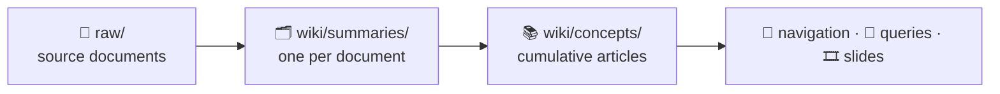

# 🩺 my-wiki

An **AI-compiled personal health wiki** — raw lab results, imaging reports, and clinical notes go in; a cross-linked, bilingual medical knowledge base comes out, compiled and maintained entirely by AI prompts.

The maintainer's wiki currently contains 📚 **70** concept articles · 🗂️ **17** clinical domains · 📄 **81** source documents · 💬 **23** saved Q&As · 🎞️ **9** slide decks · 🈶 bilingual (English · 繁體中文). The Obsidian graph view below shows the current state of the wiki. **A fresh clone starts empty and grows as you ingest your own documents.**

<p align="center">
  
</p>

> ⚕️ **Scope: medical data only.** The tagging taxonomy, article formats, and MOC (Map of Content) structure are purpose-built for clinical domains. Non-medical documents (finance, recipes, general notes) can't be meaningfully tagged here — use a separate wiki for those.

## 📇 Table of Contents

<table>
  <tr>
    <td><a href="#-overview">✨ Overview</a></td>
    <td><a href="#-prerequisites">📦 Prerequisites</a></td>
    <td><a href="#-getting-started">🚀 Getting Started</a></td>
    <td><a href="#-workflows">🧭 Workflows</a></td>
  </tr>
  <tr>
    <td><a href="#-running-in-codex">🤖 Running in Codex</a></td>
    <td><a href="#-directory-structure">📂 Directory Structure</a></td>
    <td><a href="#-tagging-system">🔖 Tagging System</a></td>
    <td><a href="#-mobile-access-optional">📱 Mobile Access</a></td>
  </tr>
  <tr>
    <td><a href="#-git-setup">🔧 Git Setup</a></td>
    <td><a href="#-conventions">📐 Conventions</a></td>
    <td><a href="#-deep-dive-how-it-works">🔬 Deep Dive: How It Works</a></td>
    <td><a href="#-inspiration">💡 Inspiration</a></td>
  </tr>
  <tr>
    <td><a href="#-license">📄 License</a></td>
    <td></td>
    <td></td>
    <td></td>
  </tr>
</table>

## ✨ Overview

Source documents in `raw/` — lab panels, imaging reports, clinical notes, medication records — are ingested and transformed into structured **concept articles**, **summaries**, **Q&A records**, and **slide decks**, all cross-linked with Obsidian-style `[[backlinks]]` and glossed inline with Traditional Chinese for clinical vocabulary.



Two file types, two jobs: a **summary** answers *"what did this report say?"* (frozen at its date); a **concept** answers *"what do we know about this now?"* (cumulative across every document that touches the topic). The [Deep Dive](#-deep-dive-how-it-works) explains the machinery behind that split.

## 📦 Prerequisites

| Requirement | Needed for | Notes |
|---|---|---|
| **Claude Code** or **Codex** | every workflow | The prompts are the program; the agent executes them. |
| **Python 3.9+** | `/ingest-first`, `/ingest-increm`, `/post-ingest`, `/session-close`, `/contradiction-check`, `/deep-check`, `/lint`, `/translation-backfill` | The `scripts/` checkers are standard-library only — no `pip install` step. 3.9 is the floor (built-in generic annotations). |
| **Node.js** | `/slides` only | Decks render via `npx --yes @marp-team/marp-cli@latest`. Without Node, every other workflow still works. |
| **Obsidian** | optional | For browsing the vault and following `[[backlinks]]`. No workflow depends on it. |

`/qa`, `/session-qa`, `/session-reopen`, `/triage-queries`, and `/synthesis` need only the
agent. Ingest and `/session-close` invoke the Python translation/QA checkers, as do the
maintenance passes (`/post-ingest`, `/contradiction-check`, `/deep-check`, `/lint`,
`/translation-backfill`).

To confirm the Python side on a fresh clone:

```
python3 scripts/tag-index.py
```

It prints empty `CONCEPTS` and `SUMMARIES` tables until you ingest something; that
empty output is the success case.

## 🚀 Getting Started

Using **Claude Code** (for Codex, see [Running in Codex](#-running-in-codex)):

1. Open a terminal in this directory and start Claude Code:
   ```
   claude
   ```
2. Drop source documents into `raw/`.
3. Run `/ingest-first` to build the wiki from scratch, or `/ingest-increm` to add only new files.
4. After each `/ingest-increm`, run `/post-ingest` to canonicalize tags, check backlinks, and refresh MOCs.
5. Use `/qa` to ask a one-off question. The result is saved immediately to `wiki/queries/`.
6. For a conversational session with follow-up questions:
   - Run `/session-qa your question` — the session starts automatically on the first question.
   - Keep asking follow-ups with `/session-qa your next question`; each turn appends a compact summary to `wiki/sessions/log.md` (read for context on the next turn) and the full answer to `wiki/sessions/current.md` (used only when the session closes).
   - When done, run `/session-close` — it saves substantive Q&A turns to `wiki/queries/`, archives both session files to `wiki/sessions/archive/` (as `YYYY-MM-DD-{topic-slug}.md` + `YYYY-MM-DD-{topic-slug}-log.md`), and removes both `current.md` and `log.md`.

<details>
<summary><b>Ongoing maintenance &amp; extras</b> — the periodic commands beyond your first run: monthly <code>/deep-check</code> for content quality, occasional <code>/contradiction-check</code> and <code>/triage-queries</code>, quarterly <code>/lint</code>, and <code>/slides</code> for presentations</summary>

7. Run `/deep-check` monthly for content quality (thin articles, missing aliases, coverage gaps).
8. Run `/contradiction-check` occasionally to catch numeric claims that drifted out of sync — it applies the unambiguous corrections itself and hands you a menu for the rest. Expect a diff; review it with `git diff` before committing.
9. Run `/triage-queries` as needed to move misplaced files out of `wiki/queries/` root.
10. Run `/lint` quarterly for a full health check with a written maintenance report.
11. Use `/slides` to generate a Marp presentation on any topic covered in the wiki.

</details>

## 🧭 Workflows

<details>
<summary><b>16 workflows</b> — the complete slash-command reference: ingesting <code>raw/</code> files, one-off and multi-turn Q&amp;A sessions, the four maintenance passes, slide generation, and weekly synthesis — each with its prompt file and what it does</summary>

This project runs in either **Claude Code** or **Codex**, depending on your preference. You can switch between. In Claude Code, workflows are invoked as slash commands — type `/` followed by the command name in the Claude Code chat, e.g. `/ingest-first`.

| Prompt | Slash Command | Purpose |
|--------|---------------|---------|
| `p1-first-ingest.md` | `/ingest-first` | Compile the wiki from scratch using all files in `raw/` |
| `p2-incremental-ingest.md` | `/ingest-increm` | Add only new files in `raw/` that haven't been processed yet |
| `p3-qa.md` | `/qa` | Answer a one-off question and save the result directly to `wiki/queries/` |
| `p3a-session-qa.md` | `/session-qa` | Ask a question inside a live session — auto-starts the session if none is active; full prior conversation is in context for each follow-up |
| `p3b-session-close.md` | `/session-close` | End the session — saves worthy Q&A turns to `wiki/queries/`, archives the session log, and cleans up |
| `p3c-session-reopen.md` | `/session-reopen` | Restore a closed session from archive back to `current.md` to continue it |
| `p4a-post-ingest.md` | `/post-ingest` | Post-ingest housekeeping — canonicalize tags, check backlinks, refresh MOCs; run after every `/ingest-increm` |
| `p4b-contradiction-check.md` | `/contradiction-check` | Compare numeric claims (values, dates, ranges, counts) across `wiki/concepts/` using `scripts/extract-claims.py`. **Edits files:** unambiguous staleness against a canonical table is corrected automatically; anything needing judgement is flagged with a menu of concrete options to pick from. Prose/status contradictions are out of scope — see [Deep Dive: the contradiction check](#-deep-dive-how-it-works) |
| `p4c-deep-check.md` | `/deep-check` | Monthly content quality check — thin/missing articles, missing aliases, new article candidates |
| `p4d-triage-queries.md` | `/triage-queries` | Interactive triage of misplaced files in `wiki/queries/` root |
| `translation-backfill.md` | `/translation-backfill` | Repair missing Traditional Chinese medical-term translations in existing wiki content (see [Deep Dive: backfilling translations](#-deep-dive-how-it-works)) |
| `p4-lint.md` | `/lint` | Full quarterly health check — all tasks above plus a written report to `wiki/maintenance/` |
| `p5-slides.md` | `/slides` | Generate a Marp slide deck on a topic from wiki content |
| `p6-weekly-synthesis.md` | `/synthesis` | Summarize what was added to the wiki this week |
| `sync-to-public.md` | `/sync-to-public` | **Maintainer only.** Copy public files (prompts, commands, Codex skills, `scripts/`, the shared glossary, conventions and templates) to the companion public repo and suggest a commit message. Never copies `raw/`, wiki content, or private memory. Not needed if you are a user who cloned this repo. |

</details>

## 🤖 Running in Codex

<details>
<summary><b>Running in Codex</b> — how to run the same workflows in Codex instead of Claude Code: the <code>AGENTS.md</code> entry point, executing prompt files directly, and the full table of <code>$command</code> skills that mirror the slash commands</summary>

Codex can work in the same repository using `AGENTS.md`, which points it to the
shared conventions in `CLAUDE.md`, shared memory in `memory/`, and workflow
prompts in `prompts/`.

Codex does not use the Claude Code slash-command wrappers in `.claude/commands/`
directly. To run the same workflow in Codex, ask it to read and execute the
corresponding prompt file, for example:

```
Read and execute prompts/p2-incremental-ingest.md
```

Reusable workflows are also available as repo-scoped Codex skills with names
matching the Claude slash commands:

| Claude Code | Codex |
|-------------|-------|
| `/ingest-first` | `$ingest-first` |
| `/ingest-increm` | `$ingest-increm` |
| `/post-ingest` | `$post-ingest` |
| `/qa` | `$qa` |
| `/session-qa` | `$session-qa` |
| `/session-close` | `$session-close` |
| `/session-reopen` | `$session-reopen` |
| `/contradiction-check` | `$contradiction-check` |
| `/deep-check` | `$deep-check` |
| `/triage-queries` | `$triage-queries` |
| `/translation-backfill` | `$translation-backfill` |
| `/lint` | `$lint` |
| `/slides` | `$slides` |
| `/synthesis` | `$synthesis` |
| `/sync-to-public` | `$sync-to-public` |
| `/commit-push` | `$commit-push-codex` |

`$commit-push-codex` mirrors `/commit-push` but uses a Codex-specific
`Co-Authored-By: Codex <noreply@openai.com>` trailer.

All durable project changes should stay in the shared repo paths (`wiki/`,
`prompts/`, `scripts/`, `memory/`) so switching between Claude Code and Codex
keeps changes synchronized through git.

</details>

## 📂 Directory Structure

<details>
<summary><b>Directory structure</b> — the full annotated layout: <code>raw/</code> sources, the <code>wiki/</code> tree (summaries, concepts, MOCs, queries, slides, sessions), and the supporting <code>scripts/</code>, <code>prompts/</code>, <code>memory/</code>, and config files</summary>

```
raw/              → source documents (never modify these)
wiki/
  home.md         → vault entry point; links to all MOCs
  index.md        → master index of all wiki content
  processed.log   → list of already-processed raw/ files
  summaries/      → one .md per source document
  concepts/       → one .md per concept/topic
  mocs/           → one moc-{domain}.md per clinical domain
  queries/        → saved Q&A outputs (files named YYYY-MM-DD-{slug}.md)
    _handoff/     → clean versions intended to be given to someone
    _superseded/  → answers replaced by a newer query
  slides/         → Marp slide decks
  maintenance/    → health check and synthesis reports
  sessions/       → transient session scratch pad (not wiki content)
    current.md    → active session full Q&A log (deleted on close)
    log.md        → compact session summary, one entry per turn (deleted on close)
    archive/      → closed sessions saved as YYYY-MM-DD-{topic-slug}.md + YYYY-MM-DD-{topic-slug}-log.md
scripts/          → automation scripts (Python pre-filters for lint prompts, claim extractor for the contradiction check, bilingual/glossary/medication/dangling-link checkers, term-candidate extractor, search and sync helpers)
memory/           → persistent facts and corrections used by Claude/Codex
.claude/
  commands/       → slash command definitions that power the workflows
prompts/          → reusable AI prompt files
CLAUDE.md         → project conventions auto-loaded by Claude Code each session
AGENTS.md         → Codex entry point that delegates to CLAUDE.md and prompts/
```

</details>

## 🔖 Tagging System

<details>
<summary><b>Tagging system</b> — the closed set of 24 canonical tags grouped by clinical domain, how a MOC forms once 3+ articles share a tag, the cross-cutting and imaging-modality tags, and what happens if a non-medical document is ingested</summary>

All concept and summary files use a **closed set of 24 canonical tags**. New tags require explicit justification (no existing tag fits, 2+ articles would use it).

**Clinical domain tags** — a MOC (`wiki/mocs/moc-{tag}.md`) is created once **3+ articles** share the tag. `biomarker` is the deliberate exception — it spans every domain, so it has no dedicated MOC. Tags still below the 3-article threshold have no MOC yet and are tracked in `home.md`'s "Tags Without a MOC" table:

| Group | Tags |
|---|---|
| Labs & biomarkers | `biomarker`, `hematology`, `immunology` |
| Metabolic / endocrine | `metabolic`, `glycemic`, `lipid` |
| Cardiovascular | `cardiology` |
| Organ systems | `hepatic`, `genitourinary`, `gastrointestinal`, `respiratory` |
| Musculoskeletal & neuro | `musculoskeletal`, `neurology` |
| Integumentary & sleep | `dermatology`, `sleep-medicine` |
| Sexual health | `sexual-health` |

**Cross-cutting tags** — span multiple domains but still earn a MOC at the same 3+ threshold (all five currently have one):
`screening` · `imaging-finding` · `clinical-finding` · `medication` · `procedure`

**Imaging modality tags** (summaries only, used alongside `imaging-finding`):
`ultrasound` · `mri` · `ct`

Non-canonical synonyms (e.g. `cardiovascular`, `lab-test`, `renal`) are mapped to their canonical equivalents in `CLAUDE.md` and must never appear in frontmatter.

### What happens if a non-medical document is ingested?

Non-medical documents (financial records, recipes, book notes, etc.) have no applicable canonical tags, so Claude would either silently misfit them into medical tags or invent new ones — both corrupting the taxonomy. The article would also lack the clinical context that makes concept articles and MOCs useful. The correct action is to reject non-medical files at ingest time and direct them to a separate wiki.

</details>

## 📱 Mobile Access (optional)

<details>
<summary><b>Mobile access</b> — read the vault on iOS/Android by pairing Obsidian with the Obsidian Git plugin as a read-only mirror: the three key plugin settings, why <code>.gitattributes</code> matters, and the one-move fix if a pull ever stalls</summary>

You can read the vault on a phone or tablet by pairing **Obsidian** with the
**Obsidian Git** community plugin, treating the device as a **read-only mirror**
of your GitHub repo — it pulls updates down but never pushes local churn back up.

**Setup:**

1. Install the Obsidian mobile app and clone **your own** repo into a vault. You'll
   need a GitHub Personal Access Token with read access — create your own; never
   reuse someone else's.
2. In the Obsidian Git plugin settings, configure the device as a pure consumer:
   - **Pull on startup: ON** — refreshes the vault each time you open the app.
   - **Merge strategy on conflicts: "Their changes"** — GitHub always wins.
   - **Push on commit-and-sync: OFF** — the phone never pushes its edits or churn.
3. Open the app — it pulls the latest on launch. (Background pulls don't run while
   the screen is locked, which is fine: opening the app is the sync trigger.)

**Why `.gitattributes` matters here.** Without line-ending normalization, mobile and
desktop disagree on LF vs. CRLF, which silently marks files "modified" and **blocks
pulls** — while the plugin still reports "up to date." The repo's `.gitattributes`
(`* text=auto eol=lf`, see [Git Setup](#-git-setup)) prevents this at the source.

**If a pull ever stalls** (stale files despite an "up to date" message): run
**Obsidian Git → "Discard all local changes" → Pull**. A read-only mirror holds
nothing worth keeping, so discarding is always safe.

> ⚠️ Obsidian's mobile git support is community-maintained and considered
> experimental. The read-only-mirror pattern above keeps it low-risk; if the clone
> ever breaks, delete the vault and re-clone — nothing is lost.

</details>

## 🔧 Git Setup

<details>
<summary><b>Git setup</b> — put the vault under version control step by step: <code>git init</code>, a recommended <code>.gitignore</code>, the <code>.gitattributes</code> line-ending fix, the initial commit, and pushing to a GitHub remote</summary>

To put this folder under version control:

1. Open a terminal in this folder and initialize a git repository:
   ```
   git init
   ```
2. Create a `.gitignore` to exclude files you don't want tracked (optional but recommended). This repo's `.gitignore` covers OS, Python, and Obsidian cruft:
   ```
   # macOS
   .DS_Store
   .AppleDouble
   .LSOverride

   # Python
   __pycache__/
   *.pyc

   # Obsidian
   .obsidian/
   ```
3. Create a `.gitattributes` to normalize line endings, so files aren't flagged as "modified" just because two platforms (e.g. macOS and a mobile Obsidian Git client) disagree on line endings — a common cause of pulls stalling on the mobile side:
   ```
   * text=auto eol=lf
   ```
   (This repo's `.gitattributes` also marks common binary assets — images, PDFs, zips — as `binary` so they're never EOL-converted.)
4. Stage all files and make the initial commit:
   ```
   git add .
   git commit -m "Initial commit"
   ```
5. To back it up to a remote (e.g. GitHub), create a new repository on GitHub, then:
   ```
   git remote add origin https://github.com/<your-username>/<your-repo>.git
   git branch -M main
   git push -u origin main
   ```
6. After that, commit changes as usual:
   ```
   git add .
   git commit -m "your message"
   git push
   ```

</details>

## 📐 Conventions

- All cross-references use Obsidian-style backlinks: `[[article-name]]` (filename without `.md`).
- Every `[[link]]` must resolve to a real file; domain references point to the domain's MOC (`[[moc-<domain>]]`), never a bare `[[<domain>]]`.
- Article formats (concept, summary, query, MOC) are defined in `CLAUDE.md` (auto-loaded by Claude Code; also human-readable).
- Never edit files in `raw/` — they are the source of truth.
- `wiki/index.md` is the entry point for browsing all content.

## 🔬 Deep Dive: How It Works

<details>
<summary><b>Expand the full internals</b> — the ingest pipeline, the canonical record and where drift comes from, the navigation layer, sessions vs. queries, how the maintenance passes divide the work, the contradiction check, script-vs-agent division of labor, and translation backfilling.</summary>

### The ingest pipeline

`raw/` → `wiki/summaries/` → `wiki/concepts/` → index, MOCs, `home.md`.

Source documents in `raw/` are never modified — they are the ground truth every
other file is derived from. `/ingest-first` processes everything; `/ingest-increm`
processes only files absent from `wiki/processed.log`.

Each source document produces **one summary** in `wiki/summaries/` — a snapshot of
what that document said, frozen at its date. The key concepts inside it then create
or update a **concept article** in `wiki/concepts/`, which is *cumulative*: it
accretes across every document that touches the topic. That asymmetry is the point.
A summary answers "what did this report say?"; a concept answers "what do we know
about this now?"

Every created or updated file also gets an entry in `wiki/index.md`, `[[backlinks]]`
to related articles, and Traditional Chinese glosses on clinical vocabulary per
`CLAUDE.md`.

### The canonical record, and where drift comes from

A concept article about a recurring measurement carries a **longitudinal table** —
one row per draw, with the date, lab, value, flag, and a link to the source summary.
That table is the record, and ingest is what appends to it.

Other articles then *restate* those values in prose: "ferritin peaked at 310 in 2019",
"a vitamin D of 28.4 prompted supplementation", "all three draws came back LOW". Ingest
updates the table; it does not revisit every sentence elsewhere that quoted it.

So contradictions in this wiki are almost never two tables disagreeing. They are **a
table that moved and a sentence that didn't** — restatement drift. Recognising that
shape is what makes the contradiction check tractable: instead of comparing every
article against every other, it only has to compare each restatement against the
table it refers to.

### The navigation layer

Four overlapping views, each for a different way of looking:

| View | Granularity | Answers |
|---|---|---|
| `wiki/home.md` | vault | Which domains exist, and how big is each? Also lists tags with too few articles to justify a MOC yet |
| `wiki/mocs/moc-{domain}.md` | domain | What is in cardiology, and how do those articles relate? Created once 3+ articles share a canonical tag |
| `wiki/index.md` | file | One entry per file — type, tags, one-line summary, related articles — grouped into domain sections |
| `[[backlinks]]` | sentence | Which specific article does *this claim* depend on? |

The first three are maintained by the workflows; backlinks are written inline as
articles are authored, and audited by `/post-ingest` and `/lint`.

### Sessions vs. queries

`wiki/sessions/` is a **drafting space** — explicitly not wiki content, never indexed,
deleted when the session closes. `wiki/queries/` is the **published output** —
permanent, indexed, backlinked.

- `/qa` is single-shot: it answers and writes straight to `wiki/queries/`.
- `/session-qa` defers everything. Each turn appends the full answer to
  `sessions/current.md` and a 2–3 sentence summary to `sessions/log.md`. Only the log
  is re-read at the start of the next turn, so a long session restores its context
  without reloading every prior answer.
- `/session-close` is the **only** bridge between the two. It blends all turns into a
  single consolidated query file, archives both session files to `sessions/archive/`,
  runs the translation pass and checker gates, then deletes the working copies.
- `/session-reopen` runs that backwards, restoring an archived session to continue it.

Inside `wiki/queries/`: the root holds current answers; `_handoff/` holds clean
documents meant to be handed to a physician (no wiki metadata sections); `_superseded/`
holds answers replaced by a newer, more complete one.

### How the maintenance passes divide the work

| Check | `/post-ingest` | `/contradiction-check` | `/deep-check` | `/lint` |
|---|:--:|:--:|:--:|:--:|
| Tag canonicalization | ✅ | — | — | ✅ |
| Missing backlinks | ✅ | — | — | ✅ |
| Dangling backlink check | ✅ | — | — | — |
| MOC freshness + `home.md` sync | ✅ | — | — | ✅ |
| Bilingual QA | ✅ | — | — | ✅ |
| Numeric contradictions | — | ✅ | — | — |
| Missing / thin concepts | — | — | ✅ | ✅ |
| Missing aliases | — | — | ✅ | ✅ |
| New article candidates | — | — | ✅ | ✅ |
| Misplaced query files | — | — | — | ✅ |
| Written maintenance report | — | — | — | ✅ |

Read the columns as cadence: `/post-ingest` after **every** `/ingest-increm` (new files
arrive with unnormalized tags, no backlinks, and absent from their MOC); `/deep-check`
monthly; `/contradiction-check` occasionally; `/lint` quarterly.

Two things are worth knowing. `/contradiction-check` sits outside `/lint` entirely, so
running only `/lint` never checks whether values agree across articles. And the dangling
backlink check is `/post-ingest`-only — it runs right after ingest, where new links are
introduced; `/lint` still surfaces the same unresolved targets indirectly, as "missing
concepts" in its thin/missing pass.

### How the contradiction check works

`scripts/extract-claims.py` reads every concept file and regroups each numeric or date
claim **under the concept it is about**, so a claim arrives next to its counterparts
instead of buried on line 51 of an unrelated article. Two kinds of block come out:

- **ANCHORED** — the concept has a longitudinal table, so that table is the reference
  and every restatement is compared against it.
- **PEER** — the concept has no table, so no claim is authoritative and they judge each
  other. Asserted values are printed in `[brackets]` and sorted, so agreement clusters
  and an outlier stands apart.

Blocks with nothing to compare are dropped. The agent then sorts each finding:

- **Tier A** — anchored block, unambiguous canonical value, mechanical substitution,
  nothing else in the sentence changes. Applied automatically.
- **Tier B** — anything else: peer blocks, more than one plausible fix, a change of
  meaning or scope, or anything needing clinical interpretation. Flagged with concrete
  options, each stating the assumption you are actually choosing between. All findings
  are presented together and the run then stops; it never picks an option for you.

**Canonical table rows are never edited.** They are the ingest-fed record; correcting
one here would overwrite data with a guess. When a table itself looks wrong, that is a
Tier B finding, not an edit.

One limitation to know: claim text in the script output is truncated at ~200
characters, so a fix landing past that point will not appear changed on the
verification re-run. Confirm those against the file using the `file:line` pointer.

### Why scripts find and the agent judges

The maintenance prompts are deliberately script-first. A pass that would otherwise read
the entire concept corpus instead runs a small standard-library Python pre-filter that
emits only what the decision needs:

| Script | Replaces |
|---|---|
| `connections-index.py` | reading every concept body to audit backlinks |
| `tag-index.py` | reading every file to check MOC coverage |
| `detect-missing-thin.py` | reading every concept to find stubs and gaps |
| `extract-claims.py` | reading the whole corpus to compare numeric claims |

The split is not about capability. Extraction has no judgement to exercise, so a script
does it better — deterministic, free, diffable between runs, and incapable of inventing
a lab value. Judgement — is this a real contradiction, is this backlink substantive, is
this the right Taiwan clinical wording — stays with the agent.

The corollary: **the checkers are a floor, not a ceiling.** They flag what they can
pattern-match. A clean checker run means nothing matched the patterns, not that nothing
was missed.

### Backfilling translations (best practice)

The patient is a native Traditional Chinese reader, so clinical vocabulary is
glossed inline (`atherosclerosis (動脈粥狀硬化)`). The rules for *what* to translate
live in `CLAUDE.md` (single source of truth); this note covers *how to scope* a
backfill pass over already-existing articles.

- **Prefer domain-sized batches, not file-by-file.** Pass a whole domain/MOC as the
  scope (e.g. `/translation-backfill moc-imaging-finding`) rather than one concept
  at a time. A MOC is used as a **manifest**: the workflow expands its `[[links]]`
  into the member concept and summary files, runs the checker over the whole set,
  and edits each. Batching keeps the same term translated consistently across
  sibling files (the glossary is loaded once and reused), and syncs `wiki/index.md`
  and the MOC prose in the same pass.
- **A MOC scope does not recurse outward.** Only the concept/summary members listed
  in that MOC are pulled in. A `[[link]]` pointing to an article in a *different*
  domain is not followed — that article is covered when you run its own domain.
- **Order by glossary coverage.** Do domains where the glossary is already warm
  first (cleaner passes, fewer new guesses), then move to sparser domains.
- **The checkers are a floor, not a ceiling.** `scripts/check-bilingual-terms.py`
  only flags terms already in the glossary dictionary — a missing first-mention
  translation, or a `(2nd)` suffix when a term recurs within one counting unit
  (the innermost heading section; for `wiki/index.md` a Compilation Summary
  paragraph or a `## {file}.md` entry block) but carries fewer than the two
  translations the policy requires (`[[backlinks]]` never count as occurrences;
  query files are exempt from this within-unit rule). Meanwhile
  `scripts/extract-term-candidates.py` surfaces pattern-detectable candidates
  (acronyms and `Phrase (ACRONYM)` definitions) that are *not* yet in the glossary
  — but neither can catch lowercase multi-word terms. The edit itself runs a
  **two-pass find**: Pass A enumerates every candidate (from the extractor worklist
  plus terms only a human/LLM reading the prose would notice), Pass B dispositions
  each one. Finish with a whole-file gate — rerun `check-bilingual-terms.py` plus a
  `--git-diff` QA pass, and `check-medication-first-mentions.py` and
  `check-glossary-delta.py` on the edited files.
- **Every clinical term is translated inline; glossary additions are selective.**
  These are two separate actions when the agent meets a new term. It is always
  glossed inline (`atherosclerosis (動脈粥狀硬化)`). It is added to
  `memory/medical-term-translations.md` only when it is *standalone and reusable*
  (analyte/lab names, anatomy, pathology, procedures, enzymes, abbreviation full
  forms, ratio names) per the "What belongs in the glossary" criterion in
  `CLAUDE.md`; a one-off phrase tied to a single sentence gets its inline Chinese
  and nothing more. If unsure of the correct Taiwan wording, add it for later
  review rather than guessing. This is *why* the checker is only a floor — the
  glossary deliberately does not contain every translatable phrase.
- **Sub-batch large MOCs.** Files are translated one-by-one, and a single pass stays
  reliable only up to ~8–12 files before the context window fills. The big MOCs
  (`moc-cardiology` ~38, `moc-screening` ~29, `moc-metabolic` ~27, `moc-lipid` ~23,
  `moc-imaging-finding` ~20) should be split into 3–4 passes of ~10 files, each with
  its own `--git-diff` QA and commit so it is self-contained and resumable. MOCs with
  ≤ ~10 members are fine to do whole in one pass.
- **Scoping a sub-batch — three ways, no need to hand-list paths.** The scope after
  `/translation-backfill` is free text:
  - explicit paths — `/translation-backfill wiki/concepts/a.md wiki/concepts/b.md …`
  - a description — `/translation-backfill first 10 concept files in moc-cardiology`
  - by suspect count — `/translation-backfill moc-cardiology — do the ~10 files with
    the most bilingual gaps first` (the checker ranks members; worst offenders first)

  However the scope is expressed, the resolved file list is reported for approval
  before any file is edited.

</details>

## 💡 Inspiration

The structure and ideas behind this project are inspired by [Andrej Karpathy's post on LLM Knowledge Bases](https://x.com/karpathy/status/2039805659525644595) (April 2026), in which he describes using LLMs to incrementally compile a personal wiki from raw source documents — with summaries, concept articles, backlinks, Q&A, Marp (Markdown Presentation Ecosystem) slides, and health-check linting — all maintained by the LLM and viewed in Obsidian.

## 📄 License

MIT License
