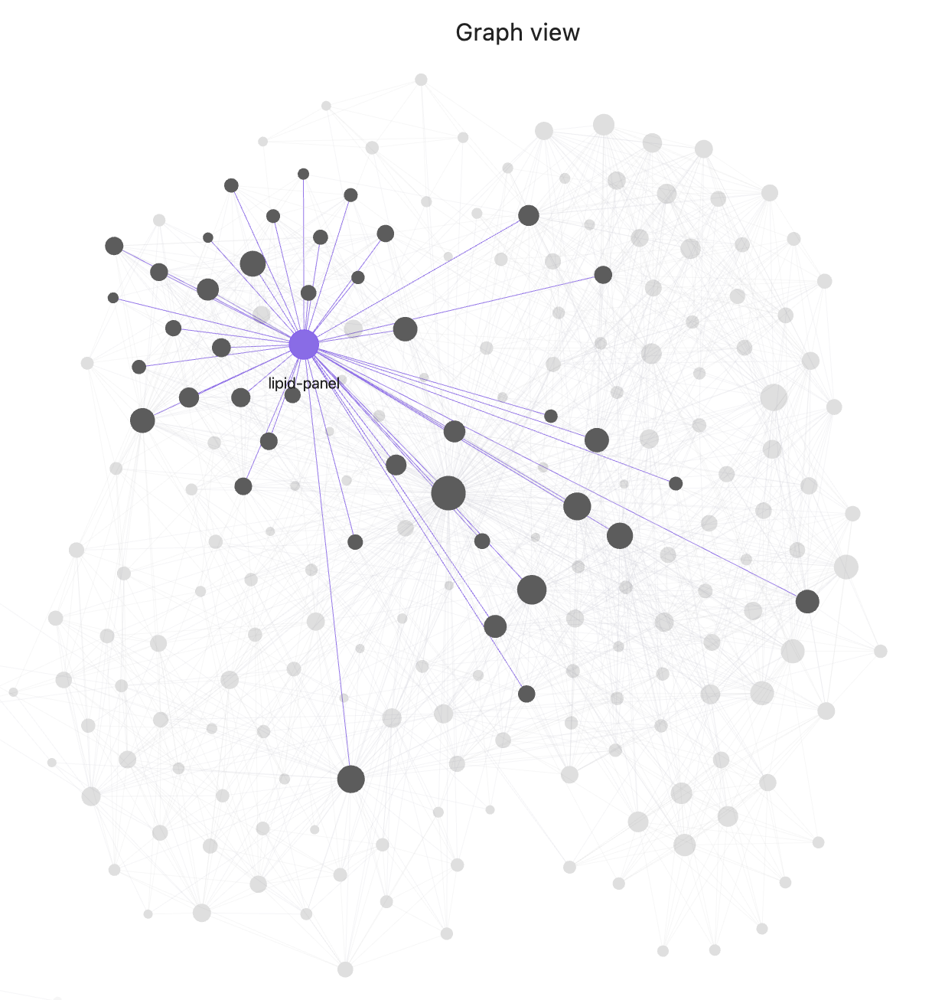
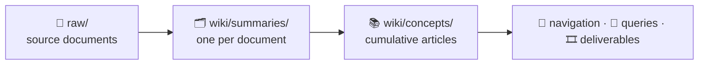

# 🩺 my-wiki

An **AI-compiled personal health wiki** — raw lab results, imaging reports, and clinical notes go in; a cross-linked, bilingual (with 繁體中文) medical knowledge base comes out, compiled and maintained entirely by AI prompts.

The maintainer's wiki currently contains 📚 **70** concept articles · 🗂️ **17** clinical domains · 📄 **80** source documents · 💬 **19** saved Q&As · 🎞️ **9** slide decks · 🤝 **4** handoff docs · 🈶 bilingual (English · 繁體中文). The Obsidian graph view below shows the current state of the wiki. **A fresh clone starts empty and grows as you ingest your own documents.**



> ⚕️ **Scope: medical data only.** The tagging taxonomy, article formats, and MOC (Map of Content) structure are purpose-built for clinical domains. Non-medical documents (finance, recipes, general notes) can't be meaningfully tagged here — use a separate wiki for those.

## 1. ✨ Overview

Source documents in `raw/` — lab panels, imaging reports, clinical notes, medication records — are ingested and transformed into structured **concept articles**, **summaries**, **Q&A records**, and **deliverables** (physician handoffs and Marp slide decks), all cross-linked with Obsidian-style `[[backlinks]]` and glossed inline with Traditional Chinese for clinical vocabulary.



Two file types, two jobs: a **summary** answers *"what did this report say?"* (frozen at its date); a **concept** answers *"what do we know about this now?"* (cumulative across every document that touches the topic). The Deep Dive section at the end explains the machinery behind that split.

## 2. 📦 Prerequisites

| Requirement | Needed for | Notes |
|---|---|---|
| **Claude Code** or **Codex** | every workflow | The prompts are the program; the agent executes them. |
| **Python 3.9+** | `/ingest`, `/post-ingest`, `/session-close`, `/contradiction-check`, `/coverage-check`, `/lint`, `/translation-backfill` | The `scripts/` checkers are standard-library only — no `pip install` step. 3.9 is the floor (built-in generic annotations). |
| **Node.js** | `/slides` only | Decks render via `npx --yes @marp-team/marp-cli@latest`. Without Node, every other workflow still works. |
| **Obsidian** | reading the vault | Recommended reading UI — graph view, `[[backlinks]]`, and search. No *authoring* workflow depends on it, but it's how the wiki is meant to be read. |

The remaining workflows (`/qa`, `/session-reopen`, `/triage-queries`, `/synthesis`) need only the agent.

To confirm the Python side on a fresh clone:

```
python3 scripts/tag-index.py
```

It prints empty `CONCEPTS` and `SUMMARIES` tables until you ingest something; that
empty output is the success case.

## 3. 🚀 Getting Started

Using **Claude Code** (for Codex, see the Running in Codex section below):

1. Open a terminal in this directory and start Claude Code:
   ```
   claude
   ```
2. Drop source documents into `raw/`.
3. Run `/ingest`. It processes every file in `raw/` that isn't already listed in `wiki/processed.log` — the same command for your first run and every one after it.
4. `/ingest` chains `/post-ingest` automatically whenever new files were added — tags, record format, frontmatter, backlinks, and MOC updates are handled with no separate step. Run `/post-ingest` on its own only to re-check after manual edits.
5. Run `/qa your question` to ask the wiki anything. Every question is a turn in a session, and the session starts automatically on the first one. Keep asking follow-ups with `/qa your next question`; each turn appends a compact summary to `wiki/sessions/log.md` (read for context on the next turn) and the full answer to `wiki/sessions/current.md`.
6. When done, run `/session-close` — it consolidates the turns into one file (`wiki/queries/`, or `wiki/deliverables/` when the result reads as a clean handoff document), archives both session files to `wiki/sessions/archive/`, and deletes the working copies. **Nothing is published until you run `/session-close`.**

## 4. 🔄 Ongoing Maintenance & Extras

The periodic commands beyond your first run:

1. Run `/coverage-check` monthly to find what the vault is missing — thin or missing articles, concept pairs that should link but don't, MOC and `home.md` drift, and new articles worth writing.
2. Run `/contradiction-check` occasionally to catch claims that drifted out of sync — first numeric ones (values, dates, counts, ranges), then medication and condition status ("currently taking" vs. "discontinued", "active" vs. "resolved"). It applies the unambiguous numeric corrections itself and hands you a menu of options for everything else; status findings are never auto-fixed. This is one of the few commands that **edits files on its own**, so it leaves uncommitted changes behind — read them before committing.
3. Run `/triage-queries` as needed to move misplaced files out of `wiki/queries/` root.
4. Run `/lint` quarterly for a full health check with a written maintenance report.
5. Use `/slides` to generate a Marp presentation on any topic covered in the wiki.

## 5. 🧭 Workflows

The complete slash-command reference — 14 workflows. They run in either **Claude Code** or **Codex** (see the Running in Codex section below); you can switch between them. In Claude Code, type `/` followed by the command name, e.g. `/ingest`.

| Prompt | Slash Command | Purpose |
|--------|---------------|---------|
| `p1-ingest.md` | `/ingest` | Process the files in `raw/` that aren't yet in `wiki/processed.log` — the only ingest workflow, covering both the first run on an empty vault and every run after it; chains `/post-ingest` automatically when new files were added |
| `p3-qa.md` | `/qa` | Ask the wiki a question — auto-starts a session if none is active, and every follow-up has the full prior conversation in context. Publishes nothing itself; `/session-close` does that |
| `p3b-session-close.md` | `/session-close` | End the session — consolidates the turns into one file in `wiki/queries/` (or `wiki/deliverables/` when the result is a clean handoff document), archives both session files, and cleans up |
| `p3c-session-reopen.md` | `/session-reopen` | Restore a closed session from archive back to `current.md` to continue it |
| `p4a-post-ingest.md` | `/post-ingest` | Housekeeping bounded to what the ingest just changed — tags, record format, frontmatter, Connections, MOC + `home.md` updates, then translation QA on its own diff. Runs automatically at the tail of `/ingest`; run it standalone only after manual edits (details in the Deep Dive section) |
| `p4b-contradiction-check.md` | `/contradiction-check` | Compare numeric claims, then medication/condition status, across `wiki/concepts/`. **Edits files:** unambiguous numeric staleness is corrected automatically; everything else is flagged with a menu of options (see the Deep Dive section) |
| `p4c-coverage-check.md` | `/coverage-check` | Monthly repo-wide content pass — thin or missing articles, missing backlinks, MOC + `home.md` reconciliation, new article candidates, and closing translation QA over what it wrote |
| `p4d-triage-queries.md` | `/triage-queries` | Interactive triage of misplaced files in `wiki/queries/` root |
| `translation-backfill.md` | `/translation-backfill` | Repair missing Traditional Chinese (繁體中文) translations in existing content (scoping principles in the Deep Dive section) |
| `p4-lint.md` | `/lint` | Full quarterly health check — every check in the maintenance matrix (see the Deep Dive section) except the contradiction check, plus a written report to `wiki/maintenance/` |
| `p5-slides.md` | `/slides` | Generate a Marp slide deck (+ rendered PDF) on a topic, saved to `wiki/deliverables/` |
| `p6-weekly-synthesis.md` | `/synthesis` | Summarize what was added to the wiki this week |
| `.claude/commands/commit-push.md` | `/commit-push` | Propose a commit message for approval, then commit and push to `origin main` |
| `sync-to-public.md` | `/sync-to-public` | **Maintainer only.** Copy the public files (prompts, commands, Codex skills, `scripts/`, the shared glossary, templates) to the companion public repo behind a fail-closed privacy gate; never copies `raw/`, wiki content, or private memory. Not needed if you cloned this repo |

## 6. 🔧 Optional Setup

Three paths that apply only if they are your situation: starting a vault from
scratch instead of cloning this one, reading it on a phone, or running Codex
instead of Claude Code. Skip whatever doesn't apply.

### 6.1 Git Setup

To put this folder under version control:

1. Initialize the repository and make the first commit:
   ```
   git init
   git add .
   git commit -m "Initial commit"
   ```
2. Two config files are worth creating before that first commit:
   - **`.gitignore`** — this repo's covers OS, Python, and Obsidian cruft (`.DS_Store`, `__pycache__/`, `.obsidian/`).
   - **`.gitattributes`** with `* text=auto eol=lf` — normalizes line endings so files aren't flagged "modified" just because two platforms disagree on LF vs. CRLF, the common cause of stalled pulls on a mobile Obsidian Git client (see the Mobile Access section below). This repo's also marks binary assets — images, PDFs, zips — as `binary` so they're never EOL-converted.
3. To back it up to a remote, create a new repository on GitHub, then:
   ```
   git remote add origin https://github.com/<your-username>/<your-repo>.git
   git branch -M main
   git push -u origin main
   ```

### 6.2 Mobile Access

You can read the vault on a phone or tablet by pairing **Obsidian** with the
**Obsidian Git** community plugin, treating the device as a **read-only mirror**
of your GitHub repo — it pulls updates down but never pushes local churn back up.

**Setup:**

1. Install the Obsidian mobile app and clone **your own** repo into a vault. You'll
   need a GitHub Personal Access Token with read access — create your own; never
   reuse someone else's.
2. In the Obsidian Git plugin settings, configure the device as a pure consumer:
   - **Pull on startup: ON** — refreshes the vault each time you open the app.
   - **Merge strategy on conflicts: "Their changes"** — GitHub always wins.
   - **Push on commit-and-sync: OFF** — the phone never pushes its edits or churn.
3. Open the app — it pulls the latest on launch. (Background pulls don't run while
   the screen is locked, which is fine: opening the app is the sync trigger.)

**Why `.gitattributes` matters here.** Without line-ending normalization, mobile and
desktop disagree on LF vs. CRLF, which silently marks files "modified" and **blocks
pulls** — while the plugin still reports "up to date." The repo's `.gitattributes`
(`* text=auto eol=lf`, see the Git Setup section above) prevents this at the source.

**If a pull ever stalls** (stale files despite an "up to date" message): run
**Obsidian Git → "Discard all local changes" → Pull**. A read-only mirror holds
nothing worth keeping, so discarding is always safe.

> ⚠️ Obsidian's mobile git support is community-maintained and considered
> experimental. The read-only-mirror pattern above keeps it low-risk; if the clone
> ever breaks, delete the vault and re-clone — nothing is lost.

### 6.3 Running in Codex

Codex can work in the same repository using `AGENTS.md`, which points it to the
shared conventions in `CLAUDE.md`, shared memory in `memory/`, and workflow
prompts in `prompts/`.

Codex does not use the Claude Code slash-command wrappers in `.claude/commands/`
directly. Instead, the same workflows are packaged as repo-scoped Codex skills
under `.agents/skills/`, with names matching the Claude slash commands:

| Claude Code | Codex |
|-------------|-------|
| `/ingest` | `$ingest` |
| `/post-ingest` | `$post-ingest` |
| `/qa` | `$qa` |
| `/session-close` | `$session-close` |
| `/session-reopen` | `$session-reopen` |
| `/contradiction-check` | `$contradiction-check` |
| `/coverage-check` | `$coverage-check` |
| `/triage-queries` | `$triage-queries` |
| `/translation-backfill` | `$translation-backfill` |
| `/lint` | `$lint` |
| `/slides` | `$slides` |
| `/synthesis` | `$synthesis` |
| `/sync-to-public` | `$sync-to-public` |
| `/commit-push` | `$commit-push-codex` |

`$commit-push-codex` mirrors `/commit-push` but uses a Codex-specific
`Co-Authored-By: Codex <noreply@openai.com>` trailer.

You can also ask Codex to read and execute a prompt file directly
(`Read and execute prompts/p3-qa.md`), but prefer the skill. Every prompt-executing
skill first loads `AGENTS.md`, `CLAUDE.md`, and `memory/MEMORY.md`; some do more
than read one prompt (`$ingest` chains the housekeeping pass, `$sync-to-public` runs
a script and no prompt at all). Executing the prompt alone silently skips those steps.

All durable project changes should stay in the shared repo paths (`wiki/`,
`prompts/`, `scripts/`, `memory/`) so switching between Claude Code and Codex
keeps changes synchronized through git.

## 7. 📂 Directory Structure

```
raw/              → source documents (never modify these)
wiki/
  home.md         → vault entry point; links to all MOCs
  index.md        → master index of all wiki content
  processed.log   → list of already-processed raw/ files
  summaries/      → one .md per source document
  concepts/       → one .md per concept/topic
  mocs/           → one moc-{domain}.md per clinical domain
  queries/        → saved Q&A outputs (files named YYYY-MM-DD-{slug}.md)
    _superseded/  → answers replaced by a newer query
  deliverables/   → outbound artifacts: prose handoff docs + Marp slide
                    decks (+PDFs)
  maintenance/    → health check and synthesis reports
  sessions/       → transient session scratch pad (not wiki content)
    current.md    → active session full Q&A log (deleted on close)
    log.md        → compact session summary, one entry per turn
                    (deleted on close)
    archive/      → closed sessions saved as YYYY-MM-DD-{topic-slug}.md
                    + YYYY-MM-DD-{topic-slug}-log.md
scripts/          → automation scripts (Python pre-filters for lint prompts,
                    numeric and status claim extractors for the contradiction
                    check, canonical-record format detector,
                    bilingual/glossary/medication/dangling-link checkers,
                    compilation-summary auditor, term-candidate extractor,
                    search and sync helpers)
memory/           → persistent facts and corrections used by Claude/Codex
.claude/
  commands/       → slash command definitions that power the workflows
.agents/
  skills/         → repo-scoped Codex skills mirroring the slash commands
prompts/          → reusable AI prompt files
docs/             → README assets (the graph-view screenshot)
CLAUDE.md         → project conventions auto-loaded by Claude Code each session
AGENTS.md         → Codex entry point that delegates to CLAUDE.md and prompts/
```

## 8. 🔖 Tagging System

All concept and summary files use a **closed set of 25 canonical tags**. New tags require explicit justification (no existing tag fits, 2+ articles would use it). `scripts/canonicalize-tags.py` enforces the set: it rewrites known synonyms and reports anything outside the list, exiting non-zero so `/lint` and `/post-ingest` fail on it.

**Clinical domain tags** — a MOC (`wiki/mocs/moc-{tag}.md`) is created once **3+ articles** share the tag. `biomarker` is the deliberate exception — it spans every domain, so it has no dedicated MOC. Tags still below the 3-article threshold have no MOC yet and are tracked in `home.md`'s "Tags Without a MOC" table:

| Group | Tags |
|---|---|
| Labs & biomarkers | `biomarker`, `hematology`, `immunology` |
| Metabolic / endocrine | `metabolic`, `glycemic`, `lipid` |
| Cardiovascular | `cardiology` |
| Organ systems | `hepatic`, `genitourinary`, `gastrointestinal`, `respiratory` |
| Musculoskeletal & neuro | `musculoskeletal`, `neurology` |
| Integumentary & sleep | `dermatology`, `sleep-medicine` |
| Sexual health | `sexual-health` |

**Cross-cutting tags** — span multiple domains but still earn a MOC at the same 3+ threshold (all five currently have one):
`screening` · `imaging-finding` · `clinical-finding` · `medication` · `procedure`

**Imaging modality tags** (summaries only, used alongside `imaging-finding`):
`ultrasound` · `mri` · `ct` · `x-ray`

Non-canonical synonyms (e.g. `cardiovascular`, `lab-test`, `renal`) are mapped to their canonical equivalents in `CLAUDE.md` and must never appear in frontmatter.

### 8.1 Provenance is not a tag

Tags answer *what is this about*. **Who produced the document** is a different axis, and summaries carry it in three dedicated frontmatter fields instead: `facility` (the site that produced it — performed the study, or wrote the prescription), `physician` (the responsible clinician, or a list when one document genuinely has several authors), and `result-status` (`normal` · `mixed` · `abnormal`).

This split is load-bearing. Provenance used to be tags — a slug per clinic, a slug per physician, plus `abnormal-result` — which put clinic names inside a closed *clinical* vocabulary and, because every facility clears the 3-article threshold, would have mechanically demanded a MOC for a laboratory. `scripts/check-provenance-fields.py` validates the values and fails if a provenance value reappears in a `tags:` list.

Both vocabularies are closed, and both live **only** in `CLAUDE.md`. `scripts/_provenance_vocab.py` parses those tables at run time, so adding a site or a clinician is a one-line edit to the documentation rather than a matching edit in two scripts — and the checkers, which are published here, carry no roster of their own.

Concepts have no provenance fields: a concept spans many draws across years, so provenance lives per-row in its canonical table (the `Lab` column, and the ordering physician in `Notes`). That makes each row a restatement of its summary's frontmatter — see the contradiction check below.

### 8.2 What happens if a non-medical document is ingested?

Non-medical documents (financial records, recipes, book notes, etc.) have no applicable canonical tags, so Claude would either silently misfit them into medical tags or invent new ones — both corrupting the taxonomy. The article would also lack the clinical context that makes concept articles and MOCs useful. The correct action is to reject non-medical files at ingest time and direct them to a separate wiki.

## 9. 📐 Conventions

- All cross-references use Obsidian-style backlinks: `[[article-name]]` (filename without `.md`).
- Every `[[link]]` must resolve to a real file; domain references point to the domain's MOC (`[[moc-<domain>]]`), never a bare `[[<domain>]]`.
- Article formats (concept, summary, query, MOC) are defined in `CLAUDE.md` (auto-loaded by Claude Code; also human-readable).
- Patient test-data values live in a Markdown table, never a bulleted list — even a single value gets a one-row table. That table is the concept's canonical record; the Deep Dive section below explains why the format matters.
- Concept and MOC frontmatter carries Chinese `aliases` plus a `cn-title` display field (`cn-title: GGT (γ-谷氨醯轉移酶)`), so the vault is searchable and browsable in Chinese while filenames, `title`, and `[[backlinks]]` stay English. Medication labels answer *"what kind of drug is this?"* rather than naming the brand, which stays in `aliases` so the pill-box name still finds the file.
- Chinese `aliases` work in Obsidian out of the box; rendering `cn-title` in the sidebar and tabs needs the **Front Matter Title** community plugin, installed per device (`.obsidian/` is not tracked, so it doesn't sync).
- Never edit files in `raw/` — they are the source of truth.
- `wiki/index.md` is the entry point for browsing all content.

## 10. 🔬 Deep Dive: How It Works

### 10.1 The ingest pipeline

`raw/` → `wiki/summaries/` → `wiki/concepts/` → index, MOCs, `home.md`. Source
documents are never modified. `/ingest` processes whatever is absent from
`wiki/processed.log` — on a fresh vault that is every file, so the first run and
every run after it are the same operation. Logged files are never re-processed,
and there is deliberately no rebuild command: concepts *integrate* new
information rather than replace it, so re-walking them would duplicate rows in
the canonical record tables, not refresh them.

Each document yields one frozen **summary**; the concepts inside it create or
update **cumulative concept articles** — the split described in the Overview
section. Every touched file gets an `index.md` entry, `[[backlinks]]`, and
Chinese glosses, and each run appends **one dated paragraph** to the
`## Compilation Summary` at the top of `wiki/index.md` — never rewriting or
extending an existing one, since `/qa` reads that block a whole paragraph at a
time and the translation checker counts terms per paragraph. The section runs
oldest-first, so appending at the end is what keeps it in date order. Because
nothing fails when an ingest forgets its paragraph,
`scripts/check-compilation-summary.py` audits the block against the ingest
history in git — it is part of `/lint`.

### 10.2 The navigation layer

Four views, maintained by the workflows; backlinks are authored inline and
audited by `/post-ingest` and `/lint`:

| View | Granularity | Answers |
|---|---|---|
| `wiki/home.md` | vault | Which domains exist, and how big is each? Also lists tags with too few articles to justify a MOC yet |
| `wiki/mocs/moc-{domain}.md` | domain | What is in cardiology, and how do those articles relate? Created once 3+ articles share a canonical tag |
| `wiki/index.md` | file | One entry per file — type, tags, one-line summary, related articles — grouped into domain sections |
| `[[backlinks]]` | sentence | Which specific article does *this claim* depend on? |

### 10.3 Sessions vs. queries

`wiki/sessions/` is a drafting space — never indexed, deleted on close;
`wiki/queries/` is the published output. Everything routes through the drafting
space. `/qa` defers: each turn appends the full answer to `current.md` and a
2–3 sentence summary to `log.md`, and only the log is re-read next turn, so a
long session restores its context cheaply. `/session-close` is the **only**
bridge — it consolidates the turns into one file, archives the session, runs the
checker gates, and deletes the working copies (`/session-reopen` reverses it).
That file is a query unless the consolidated content reads as a clean handoff
document — no Key Points, Source Articles, or Follow-up sections — in which case
it lands in `wiki/deliverables/` with no `status:` field.

Because everything is published this way, every query in `wiki/queries/` has
passed the checker gates. The cost is that an answer gets there only when you
run `/session-close`, so every turn ends with a one-line reminder that it is
still unpublished.

### 10.4 The canonical record and the contradiction check

Patient test values in a concept live in a **Markdown table** — one row per
measurement (date, lab, value, flag, source link), down to a one-row table for
a single result. A unit is not a prerequisite: a dimensionless ratio or index
the lab reported is as canonical as a value in mg/dL. Reference ranges, doses,
qualitative findings, dated events, and figures derived in the wiki rather than
reported by the lab stay prose; they carry no reported value to anchor.

The format is load-bearing. Other articles *restate* table values in prose
("ferritin peaked at 310 in 2019"), and ingest appends to tables without
revisiting those sentences — so contradictions here are almost never two tables
disagreeing. They are **a table that moved and a sentence that didn't**. That
shape is what makes checking tractable: each restatement is compared against
its table, not every article against every other.

`scripts/extract-claims.py` groups every numeric/date claim under the concept
it is about and emits two kinds of block:

- **ANCHORED** — the concept has a canonical table; restatements are compared
  against it.
- **PEER** — no table, so claims judge each other; asserted values are sorted so
  an outlier stands apart. A record mistakenly written as bullets lands here —
  the silent downgrade `scripts/detect-list-records.py` exists to catch (it
  runs in `/post-ingest` and again in `/lint`).

The agent then tiers each finding:

- **Tier A** — anchored, unambiguous canonical value, purely mechanical
  substitution: applied automatically.
- **Tier B** — everything else: flagged with concrete options, each naming the
  assumption being chosen; the run never picks one for you.

**Canonical table rows are never edited** — they are the ingest-fed record, and
a table that itself looks wrong is a Tier B finding, not an edit. One quirk:
script output truncates claims at ~200 characters, so confirm fixes past that
point against the file, not the re-run.

A third pass, `scripts/extract-provenance-claims.py`, applies the same shape to
provenance: a concept row's `Lab` cell and its `Dr. X` mention are restatements
of the `facility`/`physician` fields on the summary that row backlinks to. Here
**every finding is Tier B** — the summary fields were migrated from the old tag
layer, which was demonstrably lossy (one clinic was never tagged at all, though
five concept rows name it), so neither side is authority. Its most useful output is the
opposite of a contradiction: rows naming a site the cited summary never
recorded, which are backfill leads to confirm against `raw/`.

### 10.5 How the maintenance passes divide the work

| Check | `/post-ingest` | `/contradiction-check` | `/coverage-check` | `/lint` |
|---|:--:|:--:|:--:|:--:|
| Tag canonicalization | ✅ | — | — | ✅ |
| Provenance field validation (`facility` · `physician` · `result-status`) | ✅ | — | — | ✅ |
| Frontmatter completeness (`aliases`, `cn-title`, medication fields) | ✅ | — | — | ✅ |
| Canonical record format (table vs. bullets) | ✅ | — | — | ✅ |
| Dangling backlink check | ◐ | — | ✅ | ✅ |
| Missing backlinks | ◐ | — | ✅ | ✅ |
| MOC freshness + `home.md` sync | ◐ | — | ✅ | ✅ |
| Bilingual + glossary + medication-format QA | ◐ | — | ◐ | ◐ |
| Missing / thin concepts | — | — | ✅ | ✅ |
| New article candidates | — | — | ✅ | ✅ |
| Misplaced query files | — | — | — | ✅ |
| Compilation Summary audit | — | — | — | ✅ |
| Written maintenance report | — | — | — | ✅ |
| Numeric contradictions | — | ✅ | — | — |
| Status contradictions (medication · condition) | — | ✅ | — | — |
| Provenance contradictions (concept row vs. cited summary) | — | ✅ | — | — |

✅ = the full check · ◐ = bounded to what that run itself changed

- Read the columns as cadence: `/post-ingest` runs as the tail of every
  `/ingest`; `/coverage-check` monthly; `/contradiction-check`
  occasionally; `/lint` quarterly.
- ◐ marks each check's cheap, run-bounded form. The repo-wide sweeps cost
  the same for one document as for twenty, so they run monthly in
  `/coverage-check`, where one load of `connections-index.py` and
  `tag-index.py` serves three steps.
- Translation QA is ◐ in **every** column: `/post-ingest`, `/coverage-check`,
  and `/lint` all invoke the three checkers as `--git-diff` with no path
  arguments, so each sees only the lines that same run wrote. Nothing in this
  table re-reads translations in files it did not touch —
  `/translation-backfill` is the only workflow that does, and only within a
  scope you hand it.
- `/contradiction-check` sits outside `/lint` — running only `/lint` never
  checks whether values agree across articles.
- The Compilation Summary audit is the one check whose input is the **commit
  log** rather than the working tree: `scripts/check-compilation-summary.py`
  compares the block against the ingests recorded in git. That makes it a
  history check, not a content check, which is why it is `/lint`-only and has
  no ◐ run-bounded form.
- `scripts/check-dangling-links.py` is the repo's only wikilink resolver; the
  full sweeps in `/coverage-check` and `/lint` are the only passes that read
  the links in `index.md`, `summaries/`, `mocs/`, `queries/`, and `home.md`.
- Frontmatter completeness lives in `/post-ingest` because ingest is what
  creates files — and a medication concept missing `brand`/`taiwan-brand-name`
  silently disables first-mention enforcement for that drug repo-wide while
  still reporting clean.

### 10.6 The status pass, and why it never auto-fixes

When a medication stops or a condition remits, prose keeps asserting the old
world — a "currently taking" outlives the dated "discontinued" on the drug's
own page. `scripts/extract-status-claims.py` is the numeric pipeline with the
predicate swapped: it finds **state words** near concept mentions and emits
groups holding opposing states. Because an undated claim asserts *now*:

- **CONFLICT** — an undated claim against another undated one, or against the
  newest dated one. That is drift.
- **REVIEW** — opposing claims at different dates. That is history, not a
  contradiction.

Nothing auto-fixes, by construction: no table records status, so no state word
can be computed correct. Two exclusions came out of testing on the real vault:
level/severity wording (elevated, mild) legitimately differs between dated
measurements, and presence findings (`--include-presence`, off by default)
attached "ruled out" to whatever noun sat nearest — every hit was a false
positive.

### 10.7 Why scripts find and the agent judges

Maintenance prompts are script-first: a small standard-library pre-filter emits
only what the decision needs, instead of the agent reading the corpus.

| Script | Replaces |
|---|---|
| `connections-index.py` | reading every concept body to audit backlinks |
| `tag-index.py` | reading every file to check MOC coverage |
| `detect-thin.py` | reading every concept to find stubs |
| `check-dangling-links.py` | reading every surface to validate 3,600+ `[[links]]` |
| `extract-claims.py` | reading the whole corpus to compare numeric claims |
| `extract-status-claims.py` | reading the whole corpus to compare medication and condition status |
| `detect-list-records.py` | reading every concept to check its record is a table, not bullets |
| `check-compilation-summary.py` | walking the git history by hand to find ingests missing their `index.md` paragraph |

Extraction has no judgement to exercise, so a script does it better —
deterministic, free, diffable, and incapable of inventing a lab value.
Judgement (is this contradiction real, is this the right Taiwan wording) stays
with the agent. The corollary: **the checkers are a floor, not a ceiling** — a
clean run means nothing matched the patterns, not that nothing was missed.

### 10.8 Backfilling translations

*What* to translate is defined in `CLAUDE.md`; the step-by-step procedure lives
in `prompts/translation-backfill.md`. The scoping principles:

- **Batch by domain, not by file.** Pass a MOC as the scope — it is expanded as
  a manifest of its member concepts and summaries, keeping sibling files
  consistent and syncing `index.md` and the MOC prose in the same pass. Links
  into *other* domains are not followed.
- **Sub-batch large MOCs.** A pass stays reliable up to ~8–12 files; split
  bigger MOCs into ~10-file passes, each with its own QA and commit.
- **Warm domains first.** Start where the glossary already covers the
  vocabulary — cleaner passes, fewer new guesses.
- **Inline always, glossary selectively.** Every clinical term is glossed
  inline; only standalone, reusable terms are added to the shared glossary.
  That deliberate gap is *why* the checkers are only a floor.

The scope is free text — explicit paths, a description, or "worst offenders
first" — and the resolved file list is shown for approval before any edit.

## 11. 💡 Inspiration

The structure and ideas behind this project are inspired by [Andrej Karpathy's post on LLM Knowledge Bases](https://x.com/karpathy/status/2039805659525644595) (April 2026), in which he describes using LLMs to incrementally compile a personal wiki from raw source documents — with summaries, concept articles, backlinks, Q&A, Marp (Markdown Presentation Ecosystem) slides, and health-check linting — all maintained by the LLM and viewed in Obsidian.

## 12. 📄 License

MIT License
